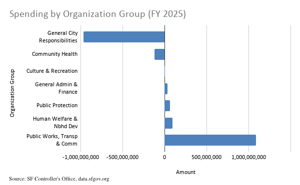
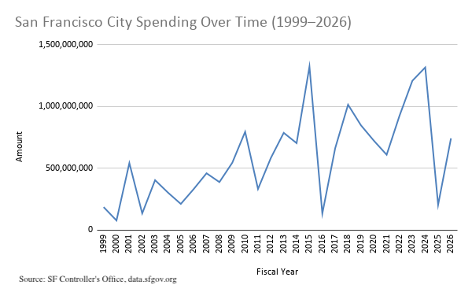

# sf-budget-analysis

# Public Works and Infrastructure Dominate San Francisco City Spending

An analysis of San Francisco city budget data spanning 1999 to 2026 finds that 
Public Works, Transportation & Commerce consistently receives the largest share 
of city spending among all organization groups. In fiscal year 2025, the category, 
which includes the Airport Commission, Port, Public Utilities Commission, and 
Municipal Transportation Agency, outpaced every other city function by a wide 
margin. When summing across all years, it also received the highest funding.
Meanwhile, departments focused on public health and city-wide obligations 
show negative net spending figures, reflecting large internal transfers and 
reimbursements that flow back into the city's general accounting.

## Data Source

This dataset was obtained from the San Francisco Open Data portal 
(data.sfgov.org) and is maintained by the San Francisco Controller's Office. 
It contains line-item revenue and spending records for all city departments 
from fiscal year 1999 through 2026, generated as part of the city's routine 
financial reporting process.

**Is it trustworthy?** As official government financial data produced by the 
city's own Controller's Office, this is a reliable source. However, some 
limitations apply: figures include internal transfers between departments, 
which can make some totals appear inflated or negative. The dataset reflects 
budgeted and actual amounts that may be revised retroactively. It also does 
not explain the policy reasons behind spending changes, which would require 
additional reporting.

[Original data source](https://data.sfgov.org/d/bpnb-jwfb)

[Google Sheets analysis](https://docs.google.com/spreadsheets/d/1tt123lkPeK-LzU6nR8Lb4xJQPAOKiqF8gHLZhvKOyYI/edit?usp=sharing)

## Key Findings

**Public Works, Transportation & Commerce is the dominant spending category.**
In FY 2025, this group recorded approximately $1.09 billion in net spending, which 
is far ahead of every other organization group. The top spending departments 
within this category include the Public Utilities Commission ($480M), the 
Airport Commission ($313M), and the Port ($124M). 

**Human Welfare & Neighborhood Development and Public Protection follow 
at a distance.** In FY 2025, Human Welfare & Neighborhood Development 
recorded approximately $95M in net spending, with Homelessness Services 
($51M) and the Community Investment and Infrastructure ($34M) among its top departments. 
Public Protection recorded approximately $65M, led by Emergency Management ($17M), which 
is the city agency responsible for coordinating emergency preparedness, response, and 
recovery, such as 911 dispatch. That's followed by the Police Department ($14.9M) and 
the Sheriff ($14.3M).

**General City Responsibilities and Community Health show large negative 
figures.** General City Responsibilities recorded -$962M and Community Health 
recorded -$119M in FY 2025. These negative values are not errors, they 
reflect accounting offsets, internal reimbursements, and transfers that flow 
back through the city's budget system. The Department of Public Health alone 
accounts for nearly all of the Community Health negative figure (-$119M), 
likely reflecting federal and state reimbursements received for services 
provided.

**City spending has grown significantly over 25 years, though the sample 
makes precise year-over-year comparisons unreliable.** The general upward 
trend in spending from 1999 to the mid-2020s reflects both population growth 
and the expansion of city services, particularly after 2009 and again after 
2020.

## Visualizations

### Spending by Organization Group (FY 2025)

*San Francisco city net spending by organization group in fiscal year 2025. 
Negative values reflect internal transfers and reimbursements. 

Source: SF Controller's Office, data.sfgov.org*

### San Francisco City Spending Over Time (1999–2026)

*Total city spending by fiscal year from 1999 to 2026, based on a random 
sample of 50,000 records. Year-to-year variation partly reflects sampling 
rather than true budget changes. 
Source: SF Controller's Office, data.sfgov.org*

## Methods and Limitations

**Data collection:** This analysis uses a random sample of 50,000 records 
drawn from the full SF budget dataset, which contains significantly more rows. 
This was done because the full dataset was too large to import into google sheets.
The sample was imported into Google Sheets, where pivot tables were used to 
aggregate spending by organization group, by department, and by fiscal year. 
Records were filtered to spending transactions only (excluding revenue lines) 
for the organization group and department comparisons.

**Important caveat on totals:** Because this analysis uses a sample rather 
than the complete dataset, all dollar totals are estimates. The relative 
rankings of departments and organization groups are likely directionally 
accurate, but the specific figures should not be treated as precise budget 
totals. A complete analysis would require the full dataset.

**Year-to-year volatility:** The spending-over-time chart shows significant 
year-to-year swings. Some of this reflects real budget changes (such as 
stimulus spending or capital project cycles), but some could reflect the uneven 
distribution of records across years in the random sample.

**What this data cannot show:** The dataset records amounts but not outcomes. 
High spending on homelessness services does not indicate success or failure, 
it reflects the scale of the crisis. A complete story would require interviews 
with budget analysts, department heads, and community advocates to explain 
what the numbers mean in practice.

## Ethical Considerations

This dataset covers institutional spending rather than individuals, so privacy 
concerns are minimal. However, there is a risk of misrepresenting communities 
by implying that high or low spending reflects policy success or failure. For 
example, the large negative figure for Community Health could be misread as 
the city "making money" on health services, when it actually reflects 
reimbursement flows. Any published story based on this data would need 
expert sources to contextualize the figures and avoid misleading readers.

Additionally, comparing raw spending across departments without accounting 
for the services they deliver, the populations they serve, or the funding 
sources they draw from risks oversimplifying complex budget decisions.
